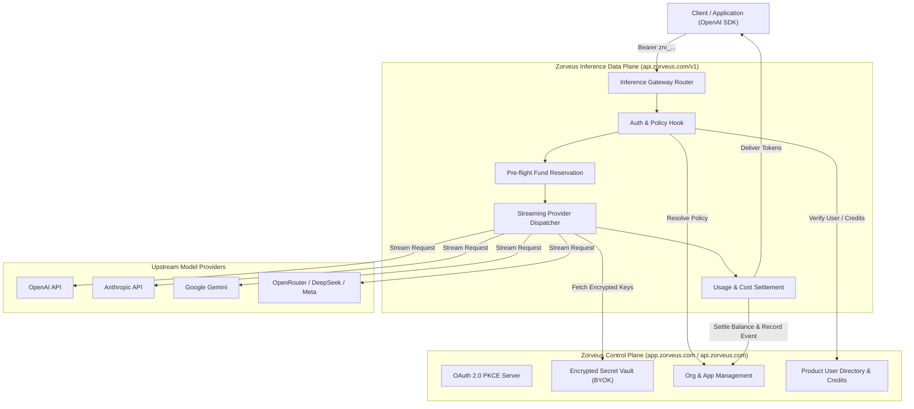

# System Architecture

Zorveus separates the **Control Plane** (workspace management, credential encryption, OAuth server, and policy definition) from the **Inference Data Plane** (high-throughput OpenAI-compatible proxy, pre-flight reservation, streaming, and settlement).

---

## High-Level Architecture Overview

---

## Request Lifecycle

<SequenceDiagram flow="inference-lifecycle" />

---

## Architectural Planes

### 1. The Inference Data Plane (`https://api.zorveus.com/v1`)
- Built for ultra-low latency streaming with zero buffering overhead.
- Validates the incoming `Bearer zrv_...` token against active connections and cached policies.
- Resolves upstream model names (e.g. `openai/gpt-4.1-mini` or `anthropic/claude-3-7-sonnet`).
- Executes atomic pre-flight wallet reservations before dispatching to upstream providers.
- Streams SSE (Server-Sent Events) chunks directly back to the client while calculating token tallies.

### 2. The Control & Management Plane (`https://api.zorveus.com`)
- Exposes RESTful endpoints for dashboard sessions and Organization Service Keys (`zrv_service_...`).
- Handles organization membership, app creation, spending cap configurations, and credit grant lifecycles.
- Encrypts and manages Bring Your Own Key (BYOK) provider credentials at rest.

### 3. The Usage & Accounting Subsystem
- Ingestion pipeline recording exact prompt/completion tokens, provider fees, and Zorveus sell amounts.
- Multi-dimensional query engine allowing instant breakdown by application, model, key, member, and product user.
- Emits real-time cap threshold notifications when spend limits are approached.

---

## Next Steps

<CardGroup cols={2}>
  <Card title="Apps, Connections, and Keys" icon="layers" href="/concepts/apps-connections-and-keys">
    Learn how organizations, applications, and inference keys relate to each other.
  </Card>
  <Card title="Funding and Billing Models" icon="shield" href="/concepts/funding-and-billing">
    Understand the mechanics of wallet debit, BYOK zero-margin routing, and credit grants.
  </Card>
</CardGroup>
